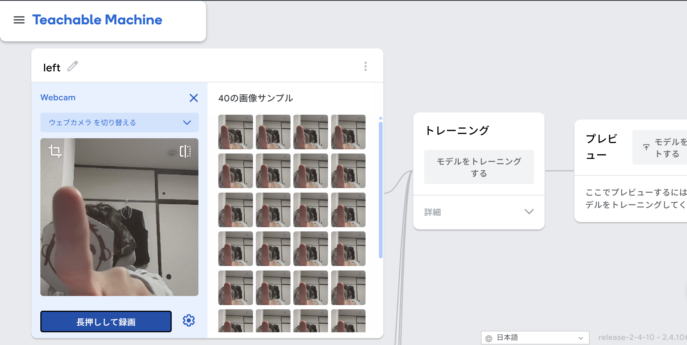

# AI-based Touchless Mimic
>AI-based Touchless Mimic(ATM)は、画像認識技術を活用して、タッチに対応していないディスプレイでもタッチを可能にした次世代ATMです。


[](https://www.python.org/downloads/)
[](LICENSE)
[]()

## 制作時期
2025年12月～2026年1月

## 作品概要

本システムは、従来のタッチパネル式ATMが抱える接触感染リスクや、物理ボタン操作から起こるスキミング対策として開発された、次世代の「AI非接触ATMシミュレーター」です。昨今の公衆衛生への意識の高まりや、デジタルトランスフォーメーション（DX）の流れを受け、より安全で直感的な金融取引体験を提供することを目的としています。

最大の特徴は、Webカメラを用いた**ジェスチャー認識技術**です。ユーザーは画面やキーパッドに直接触れることなく、手を「左に出す」「右に出す」「前に出す」といった自然な動作だけで、「振込」「引き出し」「口座作成」といった主要な銀行取引を完結させることができます。AIモデルにはTensorFlowを活用し、リアルタイムかつ高精度な認識を実現しました。

また、ユーザー体験（UX）の向上にも力を入れています。操作ごとに直感的な**音声ガイダンス**や効果音（SE）が再生され、画面を見なくても操作の完了や入力を確認できるユニバーサルデザインを採用しています。さらに、セキュリティ面でも、PINコードのソルト付きハッシュ化保存や、取引金額の上限設定など、実運用を想定した堅牢な設計を取り入れています。

デザイン面では、視認性の高い配色と大きな文字を採用し、高齢者やデジタル機器に不慣れな方でも迷わず操作できるよう配慮しました。デバッグモードを搭載しており、開発やデモンストレーション時にはAIの認識状況や内部ステータスを可視化することも可能です。

## 必要動作環境
*   **Python 3.10** (必須)
*   **Webカメラ**
*   **Windows 11** 推奨（他のバージョンのWindowsやLinux, macOS では動作確認していません。）
*   **3GB** 以上の空き容量

## 使用ライブラリ
*   tensorflow == 2.15.0
*   opencv-python == 4.9.0.80
*   numpy == 1.26.4
*   pillow
*   pygame
*   pyyaml
*   h5py

## インストール

### バイナリダウンロード（推奨）

最新版: [Releases](https://github.com/HR0620/ATM-simulator/releases/latest)

<details>
<summary><b>Windows</b></summary>

[Releasesページ](https://github.com/HR0620/ATM-simulator/releases/latest)から `ATM-simulator.zip` をダウンロードし、解凍して実行してください。

> **注意**: Windows Defenderの警告が出る場合は「詳細情報」→「実行」をクリック
</details>

### ソースからビルド
```bash
git clone https://github.com/HR0620/ATM-simulator.git
cd ATM-simulator
python -m venv venv
source venv/bin/activate
pip install -r requirements.txt
python run.py
```

## 動作デモ

### 待機画面・顔検出
ユーザーがカメラの前に立つと自動的に顔を検出します。


### メインメニュー
ジェスチャー操作で「振り込み」「引き出し」「口座作成」を選択します。


###  暗証番号入力
キーボードを使用して暗証番号を入力します。


### 確認画面
取引内容を確認し、ジェスチャーで確定します。


### 取引完了
処理結果が表示され、音声ガイダンスと共に終了します。


## ディレクトリ構成
```
.
├── src/                # ソースコード
│   ├── ai/             # AIロジック（モデルロード・推論）
│   ├── core/           # アプリ制御（コントローラー・状態管理）
│   ├── ui/             # 画面描画（Tkinter）
│   ├── vision/         # カメラ処理（OpenCV）
│   └── main.py         # アプリ本体
├── resources/          # 外部リソース（ビルド時コピー対象）
│   ├── assets/         # 画像・音声
│   ├── config/         # 設定 (atm_config.yml, 顔検出用XML)
│   ├── model/          # AIモデル
│   └── icon.ico        # アプリアイコン
├── scripts/            # ビルド用スクリプト (clean_and_build.py 等)
├── docs/               # ドキュメント用画像など
├── data/               # 運用データ（口座情報等 / gitignore対象）
├── tools/              # 開発補助・デバッグツール
├── run.py              # 開発用実行エントリ
├── requirements.txt    # 依存ライブラリ一覧
├── pyproject.toml      # プロジェクト定義
```

## FAQ (よくある質問)

<details>
<summary>
<b>
Q: ATM-Simulator.exe を実行すると Windows Defender などの警告が出るのですが？
</b>
</summary>

A: **「詳細情報」→「実行」** や、**「今回だけ許可」**　をクリックしてください．
</details>

<details>
<summary>
<b>
Q: このツールはWindowsで使えますか？
</b>
</summary>
A: **Windows 11**では動作確認済みです。詳細は[インストール](#インストール)をご覧ください。
</details>

<details>
<summary>
<b>
Q: アプリの設定ファイルはどこにありますか？
</b>
</summary>
A: `./resources/config` の中にございます。編集したい場合は `atm_config.yml` を編集してください。
</details>

<details>
<summary>
<b>
Q: 左のボタンをクリックしているのに、右のボタンが反応してしまいます。
</b>
</summary>
A: 背景に **薄橙色** のものがあると、誤認識してしまうことがあります。薄橙色のものを移動させたり違う場所で試すと改善する場合がございます。ユーザー様用にチューニングしたい場合は、以下の手順を試してみてください。

1. [Teachable Machine](https://teachablemachine.withgoogle.com/) にアクセスし、「使ってみる」をクリック
2. 「画像プロジェクト」→「標準画像モデル」を選択
3. 「**Class 1**」「**Class 2**」「**Class 3**」「**Class 4**」にそれぞれ「**left**」「**center**」「**right**」「**free**」と名前を付ける
4. それぞれにジェスチャーを割り当てる(「free」には「left」「center」「right」に当てはまらないジェスチャーを割り当てる)
   
   
5. 「**トレーニング**」をクリックし、プレビューで動作を確認する。
6. 「**モデルをエクスポートする**」をクリックし、「**Tensorflow**」→「**モデルをダウンロード**」をクリック
7. ダウンロードできたzipファイルを解凍し、中の「**keras_model.h5**」を「**resources/model**」に移動する
8. 「**run.py**」を実行し、動作を確認する
</details>

### その他の問題
[Issues](https://github.com/HR0620/ATM-simulator/issues) で質問・報告してください。

## ライセンス

MIT ライセンス - 詳細は [LICENSE](LICENSE) を参照してください。

---

Made by [HR0620](https://github.com/HR0620)