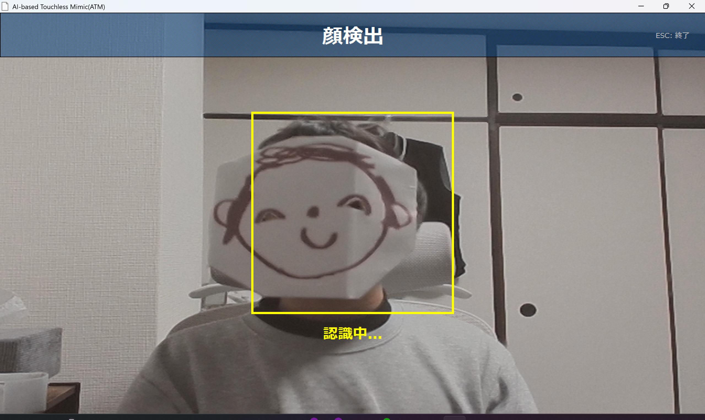
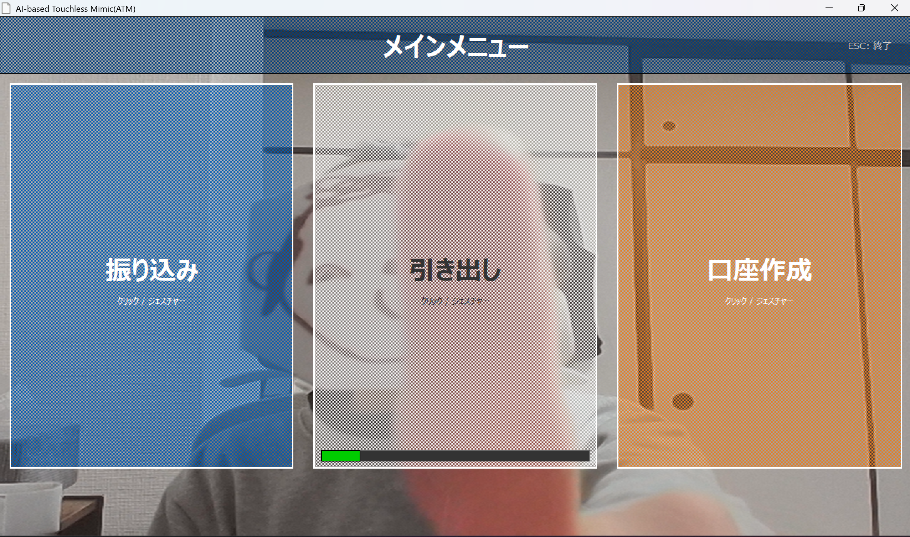
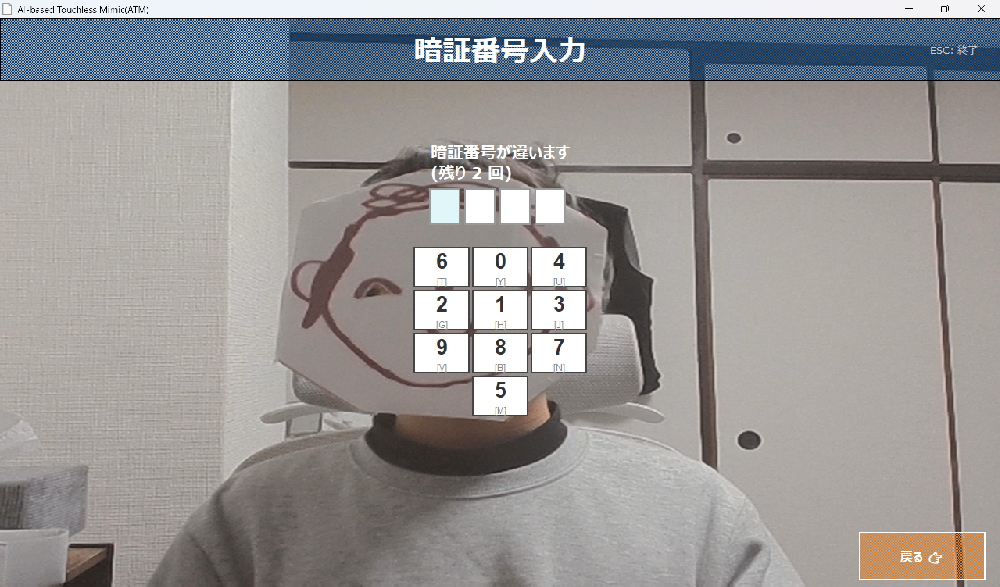
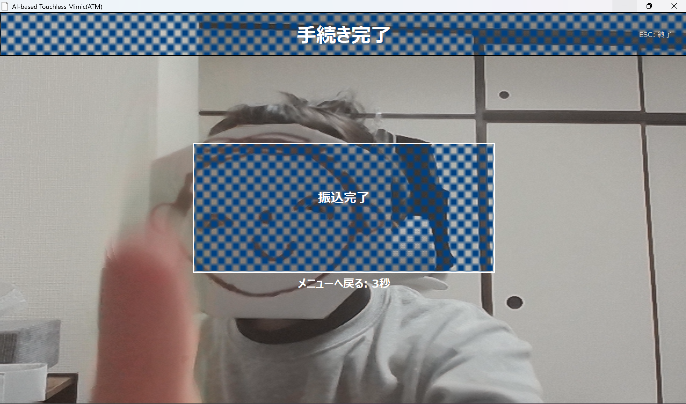

# AI-based Touchless Machine
>AI-based Touchless Machine (ATM)は、画像認識技術を活用して、タッチに対応していないディスプレイでもタッチを可能にした次世代ATMです。

<div align="center">

</div>

<div align="center">

[](https://www.python.org/downloads/)
[](LICENSE)
[](Since)

</div>

## 制作時期

2025年12月～2026年1月

## 作品について

### 概要

本システムは、従来のタッチパネル式ATMが抱える接触感染リスクや、物理ボタン操作から起こるスキミング対策として開発された、次世代の「**AI式非接触ATM**」です。昨今の公衆衛生への意識の高まりや、デジタルトランスフォーメーション（DX）の流れを受け、より安全で直感的な金融取引体験を提供することを目的としています。

### 特徴

最大の特徴は、Webカメラを用いた**ジェスチャー認識技術**です。従来の全体的なジェスチャー認識に加え、**指先の位置追跡 (Finger Tracking)** 技術を導入しました。ユーザーは画面に触れることなく、指でボタンを押すという直感的な操作で、「振込」「引き出し」「口座作成」などの取引をスムーズに行えます。

誤操作防止機能として、**同一方向への連続入力防止**や、**画面上部への誤検知フィルタ**を搭載しており、意図しない操作を極限まで排除しています。

### 技術要素

AIモデルには、物体検出・骨格推定のデファクトスタンダードである **Ultralytics YOLOv8-Pose** を採用しました。これにより、手の形状だけでなく「手首」や「肘」の座標を高精度に検出し、そこから指先位置をベクトル演算で推論することで、高速かつ正確なポインティングを実現しています。Python 3.13 環境に対応し、非同期推論（Async Inference）によりUIの描画遅延を防いでいます。

顔検出機能には **OpenCV** のHaar Cascadeを採用し、ユーザーがカメラの前に立つと自動的に顔を検出して適切な位置へ誘導します。

UIは **Tkinter** をベースに構築され、カメラ映像をリアルタイムで背景に表示しながら、半透明のオーバーレイで情報を描画しています。

### 工夫点

ユーザー体験（UX）の向上に注力しました。操作ごとに直感的な**音声ガイダンス**や効果音（SE）が再生され、画面を見なくても操作の完了を確認できるユニバーサルデザインを採用しています。

ボタンのフィードバックには「**Visual Press Effect**」を実装し、ジェスチャーで選択したボタンが物理的に押し込まれたかのような視覚効果（影の移動とオフセット）をデジタル上で再現しています。ユーザーのアクションに対して、視覚と聴覚の両方でフィードバックを行うことで、より直感的で気持ちの良い操作感を実現しました。

セキュリティ面では、PINコードのソルト付きハッシュ化保存や、連続入力失敗時のロック機能を実装しています。

## 必要動作環境

*   **Python 3.13** 以上 (必須)

```bash
python --version
```

でバージョンを確認してください。
    
[Python のインストールはこちら](https://www.python.org/downloads/)

*   **Webカメラ**
*   **Windows 11** 推奨（他のバージョンのWindowsやLinux, macOS では動作を確認していません。）
*   **5GB** 以上のストレージ空き容量

## 使用ライブラリ

*   ultralytics
*   opencv-python
*   numpy
*   pillow
*   pygame
*   pyyaml
*   h5py

## インストール

### バイナリダウンロード（推奨）

最新版: [Releases](https://github.com/HR0620/ATM-simulator/releases/latest)

<details>
<summary><b>Windows</b></summary>

[Releasesページ](https://github.com/HR0620/ATM-simulator/releases/latest)から `AI-based Touchless Machine (ATM).zip` をダウンロードし、解凍して実行してください。

> **注意**: Windows Defenderの警告が出る場合は「詳細情報」→「実行」をクリック
</details>

### ソースからビルド

```bash
git clone https://github.com/HR0620/ATM-simulator.git
cd ATM-simulator
python -m venv venv
venv\Scripts\activate
pip install -r requirements.txt
python run.py
```

## 動作デモ(v1.2.0)

### 待機画面・顔検出

ユーザーがカメラの前に立つと自動的に顔を検出します。



### メインメニュー

指先操作で「振り込み」「引き出し」「口座作成」を選択します。



### 暗証番号入力

キーボードを使用して暗証番号を入力します。



### 確認画面

取引内容を確認し、ジェスチャーで確定します。


### 取引完了

処理結果が表示され、音声ガイダンスと共に終了します。



## ディレクトリ構成

```
.
├── src/                # ソースコード
│   ├── core/           # アプリ制御（コントローラー・状態管理）
│   ├── ui/             # 画面描画（Tkinter）
│   ├── vision/         # カメラ処理・AI (YOLOv8/OpenCV)
│   └── main.py         # アプリ本体
├── resources/          # 外部リソース（ビルド時コピー対象）
│   ├── assets/         # 画像・音声
│   ├── config/         # 設定 (atm_config.yml)
│   ├── model/          # AIモデル (yolov8n-pose.pt)
│   └── icon.ico        # アプリアイコン
├── scripts/            # ビルド用スクリプト
├── docs/               # ドキュメント用画像など
├── data/               # 運用データ（口座情報等 / gitignore対象）
├── tools/              # 開発補助・デバッグツール
├── run.py              # 開発用実行エントリ
├── requirements.txt    # 依存ライブラリ一覧
├── pyproject.toml      # プロジェクト定義
```

## FAQ (よくある質問)

<details>
<summary>
<b>
Q: ATM-Simulator.exe を実行するとセキュリティ警告（Windows Defender等）が出るのですが？
</b>
</summary>

A: 本アプリは未署名のバイナリであるため、Windowsによって警告が表示される場合があります。**「詳細情報」→「実行」** をクリックしてください。
</details>

<details>
<summary>
<b>
Q: このツールは Windows 以外でも使えますか？
</b>
</summary>

A: 現時点では **Windows 11** でのみ動作を確認しています。詳細は[インストール](#インストール)をご覧ください。
</details>

<details>
<summary>
<b>
Q: アプリの設定ファイルはどこにありますか？
</b>
</summary>

A: `./resources/config` フォルダ内の `atm_config.yml` です。編集することでアプリの動作設定を変更できます。
</details>

<details>
<summary>
<b>
Q: 意図しないボタンが反応してしまいます。
</b>
</summary>

A: YOLOv8-Pose モデルを使用していますが、背景に複雑な模様や人物のような形状があると誤認識する場合があります。また、手が画面の端に近すぎたり、照明が暗すぎると認識精度が低下します。

設定ファイルの `vision` セクションで `min_detection_confidence`（信頼度閾値）を上げることで、誤検出を減らすことが可能です。
</details>

<details>
<summary>
<b>
Q: ボタンが反応しない。
</b>
</summary>

A: 本システムは、手首の位置によってどこのボタンを押しているか判定しています。そのため、画面から **70cm** 以上離れて、背筋を伸ばしてご利用ください。
</details>

<details>
<summary>
<b>

Q: `python run.py` でエラーが出て実行できません。
</b>
</summary>

A: 主に以下の3点について、お使いの環境を確認してください。

1. **Python バージョンの確認**:
   * 本システムは **Python 3.13** 以降の最新機能を活用しています。`python --version` を実行し、バージョンが **3.13.0** 以上であることを確認してください。

2. **依存ライブラリの整合性 (OpenCV / NumPy)**:
   * Python 3.13 環境ではライブラリの組み合わせが重要です。特に OpenCV と NumPy のバージョンが古いと正しく動作しません。以下のコマンドで `pip` を更新した上で、依存関係を強制的に再インストールしてみてください：

     ```bash
     pip install -U pip
     pip install -r requirements.txt --force-reinstall
     ```

3. **カメラデバイスとアクセス権限**:
   * Webカメラが正しく接続され、他のアプリケーション（ZoomやTeamsなど）で使用中でないことを確認してください。また、Windows の「設定 > プライバシーとセキュリティ > カメラ」で、アプリによるカメラへのアクセスが許可されている必要があります。

> [!TIP]
> 環境構築で問題が解決しない場合は、[Releases ページ](https://github.com/HR0620/ATM-simulator/releases/latest) から提供しているビルド済みのパッケージ（**EXE版**）を利用することをお勧めします。これにより、Python の環境構築なしで即座にアプリを起動できます。
</details>

### その他の問題

[Issues](https://github.com/HR0620/ATM-simulator/issues) で質問・報告してください。

## ライセンス

MIT ライセンス - 詳細は [LICENSE](LICENSE) を参照してください。

---

Made by [Renju (HR0620)](https://github.com/HR0620)