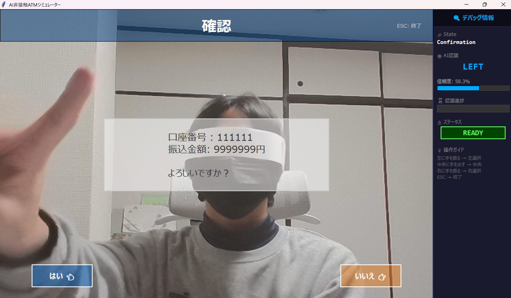

# AI非接触ATMシミュレーター

## 制作時期
2025年12月～2026年1月

## 作品概要

本システムは、従来のタッチパネル式ATMが抱える接触感染リスクや、物理ボタン操作から起こるスキミング対策として開発された、次世代の「AI非接触ATMシミュレーター」です。昨今の公衆衛生への意識の高まりや、デジタルトランスフォーメーション（DX）の流れを受け、より安全で直感的な金融取引体験を提供することを目的としています。

最大の特徴は、Webカメラを用いた**ジェスチャー認識技術**です。ユーザーは画面やキーパッドに直接触れることなく、手を「左に出す」「右に出す」「前に出す」といった自然な動作だけで、「振込」「引き出し」「口座作成」といった主要な銀行取引を完結させることができます。AIモデルにはTensorFlowを活用し、リアルタイムかつ高精度な認識を実現しました。

また、ユーザー体験（UX）の向上にも力を入れています。操作ごとに直感的な**音声ガイダンス**や効果音（SE）が再生され、画面を見なくても操作の完了や入力を確認できるユニバーサルデザインを採用しています。さらに、セキュリティ面でも、PINコードのソルト付きハッシュ化保存や、取引金額の上限設定など、実運用を想定した堅牢な設計を取り入れています。

デザイン面では、視認性の高い配色と大きな文字を採用し、高齢者やデジタル機器に不慣れな方でも迷わず操作できるよう配慮しました。デバッグモードを搭載しており、開発やデモンストレーション時にはAIの認識状況や内部ステータスを可視化することも可能です。

## 必要動作環境
*   **Python 3.10 ** (必須)
*   Webカメラ
*   Windows / Mac / Linux (Windows推奨)

## 使用ライブラリ
*   tensorflow
*   opencv-python
*   pillow
*   pygame
*   pyyaml
*   numpy
*   h5py

## セットアップと実行方法

本システムを実行するためには、Python環境のセットアップが必要です。依存関係の競合を防ぐため、**以下の手順を必ず順番通りに実行してください**。

### 1.python 3.10のインストール
[ここから](https://www.python.org/downloads/) Numpy1.26.4を使うために、必ずpython 3.10をインストールしてください。

### 2. 仮想環境の構築

```bash
python -m venv .venv
```

```bash
.venv/Scripts/Activate.ps1
```

### 3. ライブラリのインストール
依存ライブラリを一括でインストールします。

```bash
pip install -r requirements.txt
```

インストールが完了すると、以下のようなエラーメッセージが出るかもしれませんが気にしなくて良いです。

```bash
WARNING: There was an error checking the latest version of pip.
```

### 4. アプリケーションの実行
以下のコマンドでシミュレーターを起動します。

```bash
python main.py
```

## スクリーンショット

### 1. 待機画面・顔認証
ユーザーがカメラの前に立つと自動的に顔を検出します。


### 2. メインメニュー
ジェスチャー操作で「振込」「引き出し」「口座作成」を選択します。


### 3. 暗証番号入力
キーボードを使用して金額を入力します。


### 4. 確認画面
取引内容を確認し、ジェスチャーで確定します。


### 5. 取引完了
処理結果が表示され、音声ガイダンスと共に終了します。


## ディレクトリ構成
```
.
├── ai/                 # AIモデル関連 (model_loader.py)
├── assets/             # 画像・音声リソース
├── config/             # 設定ファイル (atm_config.yml)
├── core/               # アプリケーションロジック (controller, states...)
├── data/               # 口座情報
├── doc/                # README用データ
├── model/              # Teachable Machineのデータ
├── tests/              # テスト
├── ui/                 # UI描画 (screens.py)
├── main.py             # エントリーポイント
└── README.md           # 本ドキュメント
```
